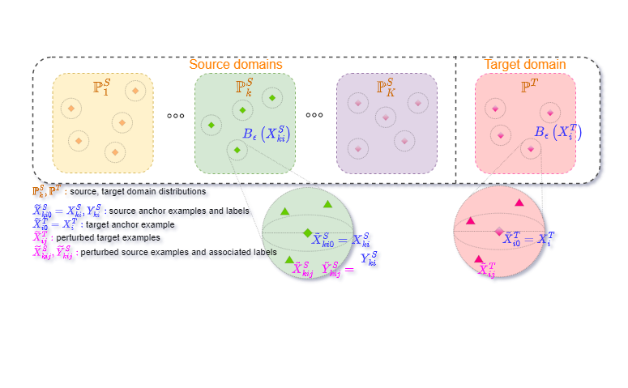

# Global-Local Regularization Via Distributional Robustness
This repository contains the Pytorch implementation of [Global-Local Regularization Via Distributional Robustness](https://arxiv.org/abs/2203.00553). 

<a href="url"></a>

If you find our code useful in your research, please cite:

```
@article{phan2022global,
  title={Global-Local Regularization Via Distributional Robustness},
  author={Phan, Hoang and Le, Trung and Phung, Trung and Bui, Tuan Anh and Ho, Nhat and Phung, Dinh},
  journal={International Conference on Artificial Intelligence and Statistics (AISTATS), 2023},
  year={2022}
}
```


### Our implementation consists of 4 subexperiments:
- [Domain adaptation](da-code)
- [Domain generalization](dg-code)
- [Semi supervised learning](ssl-code)
- [Adversarial machine learning](aml-code)

#### Reproducing:
Please refer to the bash script (*.sh) in each experiment to reproduce the results

For the running time of our approach, please refer this kernel in [Kaggle](https://www.kaggle.com/warkingleo2000/ws-ssl) as we want to utilize the cloud computing service for a fair comparision. 
